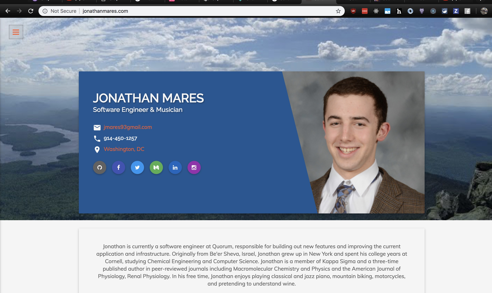

This week, while visiting grandparents in Israel, I decided to change my personal website to include a blog. My current website looks like this:



Besides updating the photo of me from 5 years ago, it was time to do some housekeeping. I chose this template a few years ago as it used Material Design and looked nice (to me, at least). At the time, I took the template and made it work in Jekyll, which made developing it a better experience. Jekyll has good blogging support in markdown, which is nice, but extending the current template to include a blog section seemed time consuming, and so I put it off for a long time.

Someone at worked linked to [GatsbyJS](https://gatsbyjs.org), which seemed like an attractive alternative to Jekyll, as it its in the `npm` ecosystem and is built with `React`, which I use at work daily. My next step was to find a place to start - `Gatsby` is very cool but has a lot of features and can be overwhelming at first.

I stumbled upon Jia's [website](https://jiahao.codes/) and was thoroughly impressed with the level of work he has put into the infrastructure and maintainability of his site. I decided to fork his repo and start from his point, which seemed much further along than any of the starter templates. Please check out his post on [Integrating All of the Things](https://jiahao.codes/blog/integrating-and-building-all-the-things/) - it's great!

I've played with `GraphQL` a little bit in my free time, but am by no means confident with it yet. One modification I made to the `GraphQL` query to get the posts was to filter for drafts:

```js
export const pageQuery = graphql`
  query IndexQuery {
    ...SiteFragment
    allMarkdownRemark(
      sort: { fields: [frontmatter___date], order: DESC }
      filter: {
        fileAbsolutePath: {
          regex: "/src/pages/blog//"
        },
        frontmatter: { draft: { ne: true } } // filter out drafts
      }
    ) {
      edges {
          node {
              ...
          }
      }
    }
```

This allows me to both keep around Jia's posts for reference as well as push code without having my unfinished posts show up on my website before they are ready. (Side note - a future improvement would be to make this dynamic - where I can toggle blog posts on/off, kind of like feature flags)

# Migrating from Gatsby V1 => V2
I also decided to upgrade to Gatsby 2.

- Update Gatsby to latest version
- Go through and run `npm install [packageName]@latest
- Uninstall `gatsby-plugin-react-next` and remove from config as Gatsby 2 fully supports React 16
- Remove the `.babelrc` file

Additional things todo for the future:
- Implement tags for posts and show related posts
